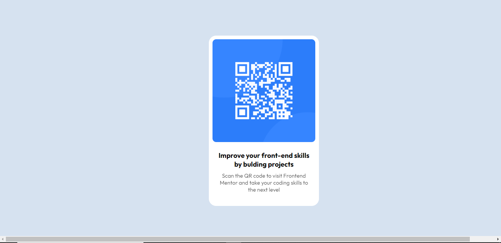

# Frontend Mentor - QR code component solution

This is a solution to the [QR code component challenge on Frontend Mentor](https://www.frontendmentor.io/challenges/qr-code-component-iux_sIO_H). Frontend Mentor challenges help you improve your coding skills by building realistic projects. 

## Table of contents

-
  - [Screenshot]
  - [Links](#links)
-    [My process](#my-process)
  - [Built with](#built-with)
  - [What I learned](#what-i-learned)
  - [Continued development](#continued-development)
- [Author](#author)


## Overview
This is a project challenge font frontend mentor It was a little challeging as a newbie  but it was fun and good for starters.

### Screenshot



### Links

- Solution URL: [Add solution URL here](https://your-solution-url.com)
- Live Site URL: [Add live site URL here](https://your-live-site-url.com)

### Built with

-  HTML5 markup
- CSS custom properties
- CSS Grid

### What I learned

I learned how to center an element within a div using grid property. I also observed that the height property may not always be needed as the height of an element grows with the content.
To see how you can add code snippets, see below:


```css
.proud-of-this-css {
  display: grid;
  place-content: center;
}
```


### Continued development

Need to work more on using <div> and centring them. i dont think I go the media query quite correctly lol. Need to work on that too


## Author

- Frontend Mentor - [@Ednsika](https://www.frontendmentor.io/profile/Ednsika)
- Twitter - [@ed_nsik](https://www.twitter.com/ed_nsika)

